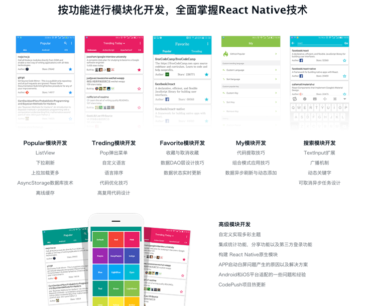

# Stu-GithubPopular

## 引言

* 仿照 [GithubPopular](https://github.com/crazycodeboy/GitHubPopular) 项目，
        根据其目前现有的功能和UI设计，学习 React-Native 项目的开发和发布流程；
* 记录我在开发过程中的心得体会；
* 如果想查看源项目，请点击上面的链接；

## 技术选型

1. "qs" - 用以 fetch 请求的参数进行转换；
2. "redux" - 状态管理库；
3. "redux-thunk" - redux的中间件；
4. "react-redux" - redux 与 react 的中间组件；
5. "react-native-splash-screen" - react-native 解决首屏白屏问题的插件库；

*to be continued...*

## 目录结构

基本的结构如下：
```
src
 |--- actions       // redux 的 action 集合
 |--- assets        // 静态资源
        |--- images
        |--- styles
               |--- common
 |--- components    // 公共组件
 |--- config        // 配置文件和静态变量
 |--- pages         // 模块页面
 |--- reducers      // redux 的 reducer 集合
 |--- utils         // 工具
 |--- setup.js      // react-native 的 统一入口根组件
```
*to be continued...*

## 需求整理

按照模块共分为6大模块：

1. Popular 模块开发；
2. Treding 模块开发；
3. Favorite 模块开发；
4. My 模块开发；
5. Search 模块开发；
6. 高级功能模块开发；

## UI 设计

详见"安卓各大应用商店"和 App Store 上的 GithubPopular 应用，这里放了一张官网的相关截图：
